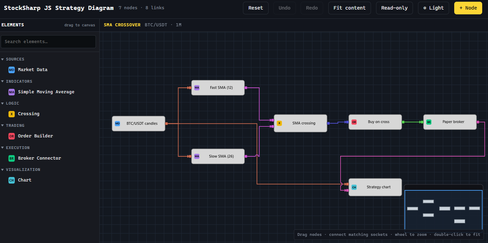

# @stocksharp/diagram

[](https://github.com/StockSharp/Diagram/actions/workflows/ci.yml)
[](https://www.npmjs.com/package/@stocksharp/diagram)
[](LICENSE)

**StockSharp JS Strategy Diagram** is the complete browser strategy-diagram
component: a typed `StockSharpDiagram` API, catalog and palette, canvas
renderer, read-only web embed, and versioned diagram document model.



[Live demo](https://stocksharp.github.io/Diagram/demo/) ·
[StockSharp website](https://stocksharp.com/) ·
[GitHub repository](https://github.com/StockSharp/Diagram) ·
[Issue tracker](https://github.com/StockSharp/Diagram/issues)

The demo uses the same full stack exported to applications. It is not a
separate mock renderer.

## Quick start

```sh
npm install @stocksharp/diagram
```

```ts
import {
  DiagramNode,
  Link,
  Node,
  StockSharpCatalog,
  StockSharpDiagram,
} from '@stocksharp/diagram';

const catalog = new StockSharpCatalog();
catalog.addNodeType(new Node({
  id: 'source',
  name: 'Market Data',
  outPorts: [{ id: 'candles', name: 'Candles', type: 'Candle' }],
}));

const host = document.querySelector<HTMLElement>('#diagram')!;
const diagram = new StockSharpDiagram({ div: host, catalog });

diagram.load([
  new DiagramNode({
    id: 'market',
    typeId: 'source',
    name: 'BTC/USDT',
    outPorts: [{ id: 'candles', name: 'Candles', type: 'Candle' }],
    x: 20,
    y: 80,
  }),
], []);

diagram.setTheme({
  diagramBackground: '#131820',
  gridColor: '#1e2633',
});
```

The package also ships a ready-to-use browser bundle exposed as
`window.SSDiagram`:

```html
<script src="https://cdn.jsdelivr.net/npm/@stocksharp/diagram@0.1.0/dist/ssdiagram.js"></script>
<script>
  const { StockSharpCatalog, StockSharpDiagram } = window.SSDiagram;
</script>
```

See the [complete example](https://github.com/StockSharp/Diagram/blob/main/examples/basic.ts)
for catalog construction, the draggable palette, typed links, history,
read-only mode, resize handling and theme switching.

The palette mirrors the Designer toolbox contract without owning host
behaviour. Subscribe to `nodeActivated` to insert/open an element and to
`contextMenuRequested` to show host-specific help. `setExcludedTypeIds()` and
`setNodeTypeExcluded()` hide elements dynamically; selection, filtering,
category expansion and catalog refreshes remain stable. Call `destroy()` when
the palette host is disposed so its catalog subscription is released.

Read-only mode remains inspectable: nodes, links and ports can still be
selected, copied and opened through host actions, while move/link/delete,
paste and history commands are disabled. Applications that need a different
policy can use `setInteractionPermissions()`.

`copySelectionToClipboard()` and `pasteSelectionFromClipboard()` use the
browser text clipboard when available and fall back to the last in-memory
copy. The versioned payload preserves node, port and link metadata and pastes
the complete selection as one undo transaction.

Node dragging snaps to the visible grid by default in `StockSharpDiagram`.
Configure it at construction time with `gridSnap` / `gridSize`, or at runtime
with `setGridSnap(enabled, size)`. Arrow keys move the current node selection
by one grid cell (Shift moves five); the whole gesture is one undo step.

Variadic input sockets use `isDynamic: true` with `dynamicMode: 'onConnect'`.
Connecting to that anchor creates a single-link sibling typed from the source;
disconnecting, relinking, or deleting the source prunes an orphan sibling. The
port and wire lifecycle is one undoable transaction and round-trips unchanged.

Port cardinality follows the Designer `LinkableMaximum` contract on both ends:
`maxLinks: 0` is unlimited, while a positive value limits that input or output.
An unlimited input accepts multiple sources and an unlimited output can fan out
to multiple targets; the same output/input pair is still never duplicated.
Use `updatePort(nodeId, direction, portId, patch)` to change `maxLinks`, type or
accepted types at runtime. Lowering a limit keeps existing wires and only
rejects new ones. `Any`, `Object`, `System.Object` and `*` are wildcard socket
types and therefore connect to every concrete type.

Drag a connected input socket with one wire to retarget that wire directly.
To move an output end, or choose one wire on a socket with several connections,
select the wire and drag its diamond endpoint handle. Dragging an output socket
itself always means "create another wire", so fan-out behaviour stays
unambiguous. Every successful relink is one undoable edit.

Wrap a host properties form in `transaction(label, action)` when it changes
several node or port fields. The edits are committed as one undo/redo operation;
if the action throws, every edit made inside it is rolled back.

The component shows a fullscreen request button in the diagram's top-right
corner. Clicking it only emits `fullscreenRequested`; it never changes page
layout or calls the browser Fullscreen API. The host decides whether to use a
CSS overlay, a modal, or `requestFullscreen()`, then acknowledges the applied
state with `setFullscreenState(value)`. That updates the icon and emits
`fullscreenChanged`. Set `showFullscreenButton: false` at construction time,
or call `setFullscreenButtonVisible(false)`, to hide the control. The button
accepts `--ssdiagram-control-background`,
`--ssdiagram-control-border` and `--ssdiagram-control-color` CSS overrides.

Viewport preferences are deliberately separate from the strategy document.
Persist `diagram.saveViewState()` in host settings and restore it with
`diagram.loadViewState(value)`. The versioned snapshot contains zoom, pan and
overview visibility; `viewChanged` fires for programmatic and interactive
viewport changes. A damaged settings value throws `DiagramViewStateError`
without modifying the current viewport.

`takeScreenshot()` returns a detached canvas exactly like the Charts API and
the WPF `SaveToImage` flow. With no options it copies the current viewport;
`takeScreenshot({ scope: 'content', pixelRatio: 2 })` renders the complete
scheme without moving or resizing the visible editor. Export options control
padding, background, grid, overview, selection and transient runtime state;
encode the returned canvas with `toBlob()` or `toDataURL()`.

The Docs/Portal helpers return a `DiagramEmbedHandle`. Re-rendering the same
host disposes its previous canvas, observers and timers; removing the host from
the DOM also disposes it automatically. Custom integrations can call
`handle.destroy()` or `destroyRenderedDiagram(host)` explicitly.
If a saved scheme references an element absent from the current palette, its
node is rendered as a transient red placeholder whose hover tooltip names the
missing type. Sites can localize that message through
`data-diagram-missing-element="Missing: {typeId}"` on the host.

### Node actions and errors

Double-click handling is opt-in. Give only the node types controlled by the
host a non-empty `openAction`, then dispatch that value from `nodeOpen`:

```ts
catalog.addNodeType(new Node({
  id: 'indicator',
  name: 'Indicator',
  openAction: 'indicatorSettings',
}));

diagram.on('nodeOpen', ({ nodes }) => {
  const node = nodes[0];
  if (node?.openAction === 'indicatorSettings') openIndicatorDialog(node);
});
```

Socket input is reported separately through `portClicked`, with
`leftClick`/`rightClick`, direction, and keyboard modifiers. A right-click
never starts a wire. `contextMenuRequested` also includes the exact port when
the menu was opened over a socket.

Runtime failures flash the node border before leaving it red. Errors found
while loading a scheme use a red background. Hovering either state shows the
full error text in a tooltip:

```ts
diagram.setNodeError('orders', 'Order volume is not configured.');

diagram.load(nodes, links, {
  nodeErrors: {
    indicator_2: 'The saved Period value is invalid.',
  },
});

diagram.clearNodeError('orders');
```

Use `{ kind: 'load' }` with `setNodeError` to add a load-style error after the
initial load. Errors applied through this API are transient and are not written
by `save()`.

### Debugger state

Execution state is deliberately separate from the saved scheme and undo
history. The host can mark the active element, publish socket values and
breakpoints, or cover an unusable scheme with a global status:

```ts
diagram.setActiveNode('indicator_2');
diagram.setPortRuntimeState('indicator_2', 'out', 'value', {
  breakpoint: true,
  breakpointActive: true,
  value: '102.45',
});
diagram.setGlobalError('This strategy is encrypted.', 'encrypted');
```

Use `setRuntimeState()` for an atomic debugger snapshot and
`clearRuntimeState()` when execution stops. `runtimeStateChanged` always
returns a detached snapshot safe for host-side state stores.

If `loadDocument()` receives malformed JSON or an unsupported document, the
currently displayed scheme is left intact, a global `load` overlay shows the
failure, and `documentLoadFailed` is emitted. The original exception is still
thrown so callers can log or report it; loading a valid document clears the
overlay.

## Architecture

The component has one document model and a separate rendering layer:

| Layer | Source | Purpose |
| --- | --- | --- |
| Document core | `src/core/*` | Versioned document serialization plus independent runtime, view and selection state |
| Public component API | `src/diagram/stocksharp-diagram.ts` | `StockSharpDiagram`: catalog-aware nodes, ports, validation, events, persistence, history and theming |
| Models and palette | `src/diagram/{types,catalog,palette}.ts` | Public data model and draggable HTML element palette |
| Web embed | `src/embed.ts` | Self-contained read-only rendering for web applications |
| Canvas renderer | `src/canvas-renderer.ts` | Internal drawing, routing, selection, editing, zoom, touch and overview |

Applications use `StockSharpDiagram` or the read-only embed. The renderer is
an implementation detail and is bundled into both entry points, so consumers
do not need a second runtime or copied source files.

## Repository layout

```text
src/
  index.ts                 complete public entry point
  core/
    model.ts               canonical versioned document
    document.ts            validation and serialization
    state.ts               runtime, view and selection state
    history.ts             commands, transactions, undo and redo
    action-registry.ts     executable context and host actions
  diagram/
    stocksharp-diagram.ts  StockSharpDiagram API
    api.ts                 typed public events and options
    types.ts               Node, DiagramNode, Port and Link models
    catalog.ts             node and socket-type catalog
    palette.ts             draggable HTML palette
    event-emitter.ts
  embed.ts                 self-contained read-only web renderer
  canvas-renderer.ts       internal canvas renderer
examples/basic.ts          full-stack demo source
demo/                      Charts-style GitHub Pages shell
tests/                     core, renderer and public-API integration tests
```

## Source-first consumption

Applications can let their own esbuild/Vite build compile the TypeScript
published inside the package:

```json
{
  "dependencies": {
    "@stocksharp/diagram": "^0.1.0"
  }
}
```

```ts
import { StockSharpDiagram } from '@stocksharp/diagram/source';
import { renderAll } from '@stocksharp/diagram/source/embed';
```

For sibling-repository development, replace the version with
`"file:../../Diagram"`; the import paths stay identical.

Dedicated entry points are available for consumers with narrower needs:

- `@stocksharp/diagram/document` - versioned document parser and serializer;
- `@stocksharp/diagram/state` - runtime/view/selection state helpers;
- `@stocksharp/diagram/history` - command and transaction history;
- `@stocksharp/diagram/actions` - typed action registry;
- `@stocksharp/diagram/embed` — compiled read-only web renderer;
- `@stocksharp/diagram/catalog`, `@stocksharp/diagram/palette`, `@stocksharp/diagram/types`.

## Build output

`npm run build` produces:

| File | Purpose |
| --- | --- |
| `dist/esm/**` | complete ESM module tree |
| `dist/types/**` | TypeScript declarations |
| `dist/ssdiagram.js` | complete browser IIFE exposed as `window.SSDiagram` |
| `demo/dist/demo.js` | full-stack interactive example (excluded from the package) |

## Commands

```text
npm ci
npm test
npm run build
npm run serve
npm run pack:check
npm run release:check -- v0.1.0
npm run release:patch
npm run release:minor
npm run release:major
npm run api:check
npm run api:update  # only after reviewing an intentional public API change
npm run test:browser
```

The local demo is served at http://localhost:8792/demo/index.html.

The browser suite covers Chromium smoke, interaction and lifecycle scenarios
at DPR 1 and 2.

CI verifies type checking, the reviewed declaration snapshot, unit/integration
tests, Chromium smoke/interaction/lifecycle checks, all bundles and tarball
contents. GitHub Pages publishes the demo from `main`.

Publishing is tag-driven. Create the version commit and tag, then push both:

```sh
npm run release:patch
git push origin main --follow-tags
```

Use `release:minor` or `release:major` when appropriate. A pushed `v<version>`
tag starts `release.yml`, which rejects a mismatched version, rebuilds and tests
the repository, creates the GitHub Release, attaches the exact `.tgz` artifact,
and publishes that tarball to npm with provenance. A failed publication can be
retried for the existing tag through the workflow's `Run workflow` action;
already-published versions are detected and skipped.

The first publication needs a short-lived npm granular access token in the
repository Actions secret `NPM_TOKEN`. After `@stocksharp/diagram` exists on npm,
configure tokenless trusted publishing, then remove the secret and revoke the
bootstrap token:

```sh
npm trust github @stocksharp/diagram --file release.yml --repo StockSharp/Diagram --allow-publish
```

## License

Copyright © 2010-present StockSharp Platform LLC and/or its affiliates. All
rights reserved. Use is governed by the StockSharp EULA and [LICENSE](LICENSE).
